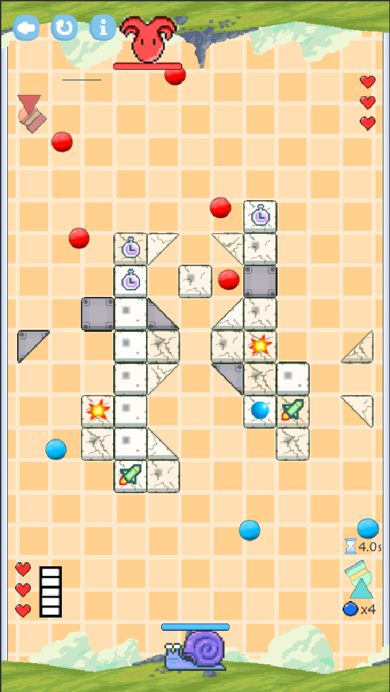
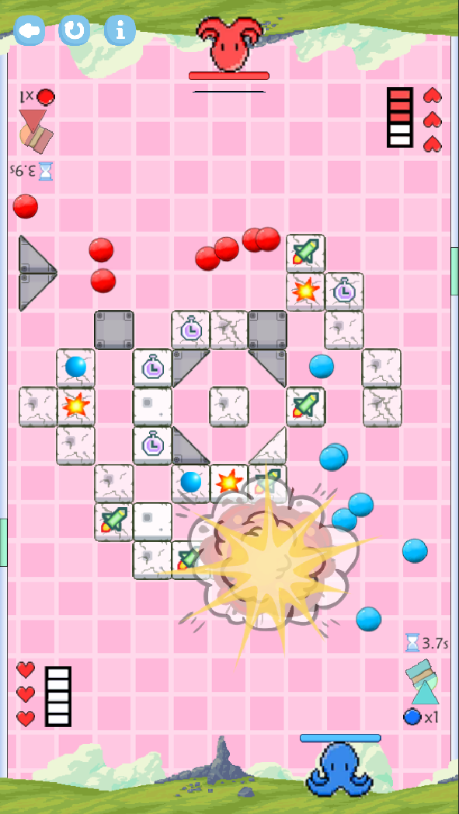
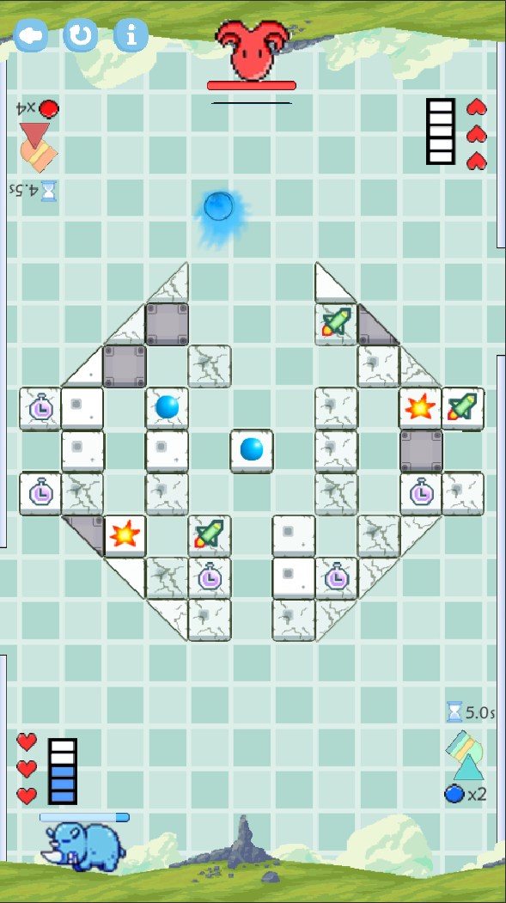

# PinballFight

An mobile two-player game based on classical brick elimination. PVE or local PVP is provided.

## ScreenShots

  

  

  

## Install

Android APK can be found in [Releases](https://github.com/yanzewu/PinballFight/releases). You can also build from Unity, where the version recommended is 2019.2.11f1.

## Contributors

[Tongheng Chen](https://github.com/tonhenc): Level design, numerical system design, UI design

[Yanze Wu](https://github.com/yanzewu): Programming and UI design

[Yiyi Chen](https://github.com/chenyiyiagnes): Level and UI design, artworks

WarDog: UI design and artworks

Fubuki: Level design
